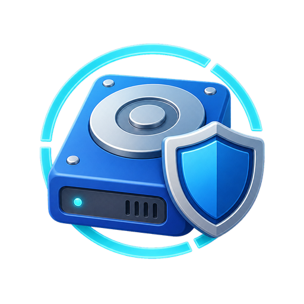

<p align="center">
  
</p>

<h1 align="center">Windows Disk Steward</h1>

<p align="center">
  <strong>安全扫描、分级清理并迁移 Windows 磁盘数据。</strong><br>
  Scan safely. Approve explicitly. Change only what was authorized.
</p>

<p align="center">
  <a href="#安装">安装</a> ·
  <a href="#使用方式">使用方式</a> ·
  <a href="#安全边界">安全边界</a> ·
  <a href="#测试">测试</a>
</p>

<p align="center">
  
  
  
  
  
  
</p>

---

一个面向 Codex 的 Windows 磁盘治理 Skill，用于安全完成：

- 只读扫描指定磁盘，默认 C 盘
- 区分“建议删除、谨慎处理、不建议删除、建议迁移”
- 报告路径、占用、风险、判断依据和副作用
- 在任何删除或迁移前取得用户对精确编号的明确批准
- 执行获批操作并验证结果
- 将持续增长的数据迁移到其他磁盘，并支持回滚

它不是“一键清理器”。扫描请求不会被视为删除授权，模糊的“全部清理”也不能绕过确认门。

## 运行要求

- Windows
- PowerShell 7 或更高版本
- 本地 NTFS 固定磁盘
- Codex Skills 环境

第一版不支持网络盘、移动盘、非 NTFS 文件系统或非 Windows 系统。

## 安装

将仓库克隆到 Codex 的全局 Skills 目录：

```powershell
$skillsRoot = if ($env:CODEX_HOME) {
    Join-Path $env:CODEX_HOME 'skills'
} else {
    Join-Path $env:USERPROFILE '.codex\skills'
}

git clone https://github.com/simonimhotep/windows-disk-steward.git `
    (Join-Path $skillsRoot 'windows-disk-steward')
```

安装后重启 Codex，使 Skill 被重新发现。

## 使用方式

在 Codex 中直接调用：

```text
使用 $windows-disk-steward 只读扫描 C 盘，告诉我哪些文件可以删除、哪些不建议删除、哪些适合迁移。不要执行清理。
```

典型工作流：

1. 只读扫描并生成报告。
2. 查看 `Dxx`、`Cxx`、`Kxx`、`Mxx` 候选编号。
3. 明确批准需要执行的精确编号或路径。
4. 运行预检，确认路径、容量、文件数量、更新时间、链接和活动进程没有变化。
5. 只执行获批项目，并保存执行结果。

分类含义：

| 前缀 | 分类 | 默认处理方式 |
|---|---|---|
| `D` | 建议删除 | 明确批准后可以进入删除计划 |
| `C` | 谨慎处理 | 必须说明影响，并再次取得精确批准 |
| `K` | 不建议删除 / 禁止操作 | 仅报告，永远不能进入执行计划 |
| `M` | 建议迁移 | 选择精确目标路径并批准后才能迁移 |

## 脚本接口

只读扫描：

```powershell
pwsh -File .\scripts\scan-windows-disk.ps1 `
    -Drive C `
    -RunDirectory <运行记录目录> `
    [-TargetDrive D] `
    [-Language zh-CN]
```

预检、执行与回滚：

```powershell
pwsh -File .\scripts\execute-approved-actions.ps1 `
    -PlanFile <approved-actions.json> `
    -Mode Preflight

pwsh -File .\scripts\execute-approved-actions.ps1 `
    -PlanFile <approved-actions.json> `
    -Mode Execute

pwsh -File .\scripts\execute-approved-actions.ps1 `
    -PlanFile <approved-actions.json> `
    -Mode Rollback
```

`-TestRoot` 仅供 `%TEMP%\windows-disk-steward-tests\<random-id>` 下的合成测试使用，不能用于绕过真实磁盘的安全检查。

## 安全边界

Skill 会拒绝：

- 磁盘根目录、整个 `Users`、用户根目录、整个 `AppData` 或 `ProgramData`
- `Windows`、`System32`、`WinSxS`、`Windows\Installer`
- 分页文件、休眠文件、活动中的 Windows 更新或恢复目录
- 通配符、相对路径、未解析变量、未知重解析点
- 未包含在当前扫描和批准计划中的路径
- 快照发生变化、相关应用仍在运行或目标盘空间不足的操作

迁移固定遵循：复制到目标盘 → 核对文件数量和总字节数 → 删除源目录 → 创建 Junction → 从原路径重新验证。任何关键校验失败都会停止后续操作；创建 Junction 失败时会尝试恢复源目录。

## 运行记录

每次运行使用独立的 `run_id`，记录通常保存在：

```text
work/disk-steward/<run-id>/
├── scan.json
├── report.md
├── approved-actions.json
├── execution-result.json
└── migration-manifest.json
```

批准与 `run_id`、候选编号、指纹和扫描快照绑定。扫描发生实质变化后，旧批准自动失效。

## 测试

仓库自带的测试只使用随机合成目录，不扫描或修改真实 C/D 盘内容：

```powershell
pwsh -NoProfile -File .\scripts\self-test.ps1
```

当前共包含27项端到端断言，覆盖只读扫描、重解析点跳过、权限失败记录、审批门、危险路径拒绝、快照漂移、精确删除、迁移、Junction 验证、失败保源和回滚。

## 项目结构

```text
├── SKILL.md
├── README.md
├── assets/
│   └── windows-disk-steward.png
├── agents/openai.yaml
├── scripts/
│   ├── scan-windows-disk.ps1
│   ├── execute-approved-actions.ps1
│   └── self-test.ps1
└── references/
    ├── safety-policy.md
    └── action-plan-schema.md
```
